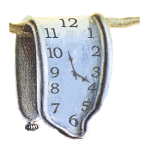

 

  

  <h3 align="center">WVL Punctuality Pal</h3>

  

    Generate watch video lecture schedule pdfs.
  

## Setup 
1. Clone the repository.
2. `cd` into the directory and `npm install`.

## Usage
1. Add exported Airtable CSVs to the `sheets/` directory.
2. Run `npm run start` to generate PDFs. PDFs will be sent to the `pdf-out/` directory.
